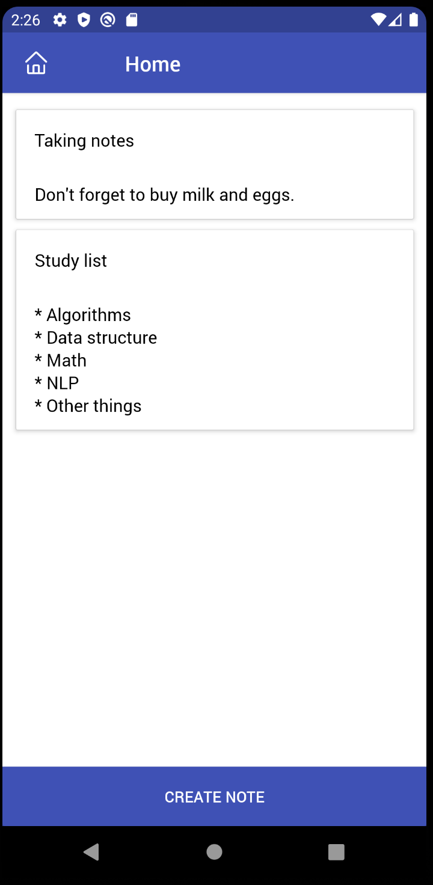
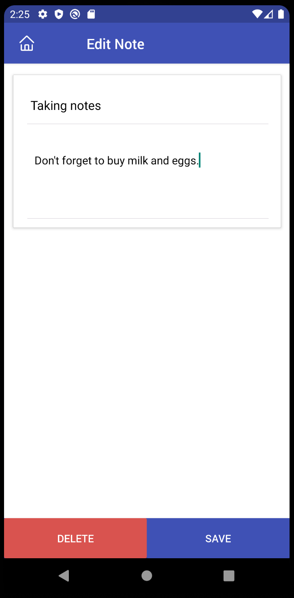

# NotesApp

Welcome to NotesApp, a simple yet effective note-taking application built using React Native. This app serves as an excellent learning tool for developers interested in mobile application development with React Native. Whether you're a beginner or an experienced developer, this app provides a hands-on example of how to create a functional mobile application with React Native and associated technologies.

## Features

- **Create and Manage Notes**: Easily create, edit, and delete notes.
- **Local Storage**: Notes are stored locally on your device using React Native Async Storage.
- **User-Friendly Interface**: Intuitive design with clear navigation.

## Screenshots

Here are some screenshots showcasing the app's user interface:

- **Home Page**:
  

- **Note Page**:
  

## Technology Stack

The app is built using the following technologies:

1. **React Native**: A popular framework for building native mobile apps using JavaScript and React.
2. **Native Base**: A UI component library that provides a set of cross-platform components for React Native.
3. **MobX-state-tree**: A state management library that provides a structured way to manage application state in React applications.
4. **MobX-react-lite**: A library that integrates MobX with React, offering a lightweight solution for state management.
5. **React Native Async Storage**: A library for storing data locally on the device.
